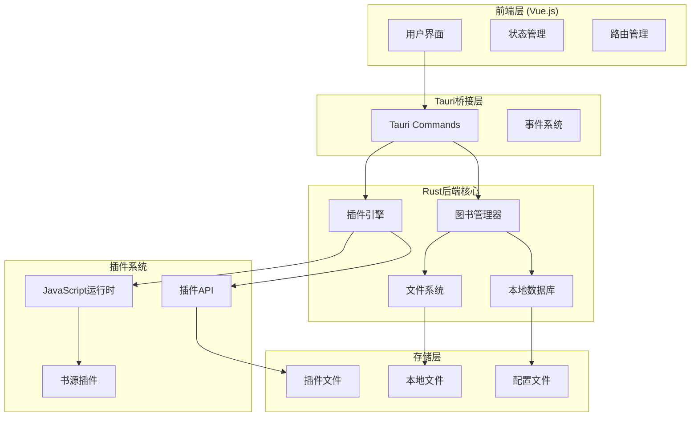
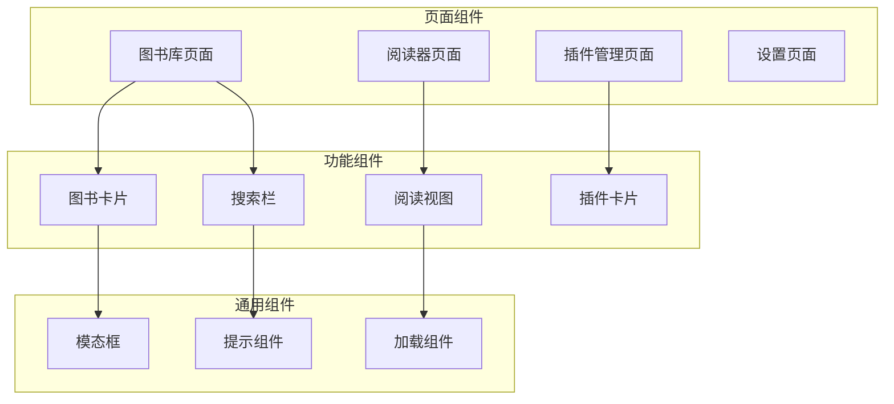

# 设计文档

## 概述

NovelNest是一个基于Tauri框架的跨平台桌面小说阅读应用。应用采用Vue.js作为前端框架，Rust作为后端核心，通过插件化架构支持多种书源的在线内容获取。应用专注于提供优质的离线阅读体验，同时通过可扩展的插件系统满足用户多样化的内容需求。

## 架构

### 整体架构



### 技术栈

- **前端**: Vue.js 3 + Vite + Vue Router + Pinia
- **后端**: Rust + Tauri 2.0
- **数据库**: SQLite (通过rusqlite)
- **插件系统**: JavaScript + Tauri Commands
- **HTTP客户端**: reqwest
- **HTML解析**: scraper
- **JavaScript执行**: Tauri内置WebView JavaScript执行
- **文件处理**: 
  - TXT: 原生Rust字符串处理
  - EPUB: epub crate
  - PDF: pdf-extract crate

## 组件和接口

### 前端组件架构



### Rust后端模块

#### 1. 图书管理模块 (BookManager)

```rust
pub struct BookManager {
    db: Arc<Mutex<Connection>>,
    storage_path: PathBuf,
}

pub struct Book {
    pub id: String,
    pub title: String,
    pub author: String,
    pub file_path: PathBuf,
    pub format: BookFormat,
    pub created_at: DateTime<Utc>,
    pub last_read: Option<DateTime<Utc>>,
    pub reading_progress: f64,
}

pub enum BookFormat {
    Txt,
    Epub,
    Pdf,
}

impl BookManager {
    pub async fn import_book(&self, file_path: PathBuf) -> Result<Book, BookError>;
    pub async fn import_folder(&self, folder_path: PathBuf) -> Result<Vec<Book>, BookError>;
    pub async fn get_all_books(&self) -> Result<Vec<Book>, BookError>;
    pub async fn search_books(&self, query: &str) -> Result<Vec<Book>, BookError>;
    pub async fn delete_book(&self, book_id: &str) -> Result<(), BookError>;
    pub async fn update_reading_progress(&self, book_id: &str, progress: f64) -> Result<(), BookError>;
}
```

#### 2. 书源插件模块 (BookSourceManager)

使用JavaScript插件 + Tauri Commands的混合方案：

```rust
// 书源插件信息
#[derive(Debug, Clone, Serialize, Deserialize)]
pub struct BookSourceInfo {
    pub id: String,
    pub name: String,
    pub version: String,
    pub author: String,
    pub description: String,
    pub base_url: String,
    pub enabled: bool,
}

#[derive(Debug, Clone, Serialize, Deserialize)]
pub struct SearchResult {
    pub title: String,
    pub author: String,
    pub description: String,
    pub source_id: String,
    pub book_url: String,
    pub cover_url: Option<String>,
}

#[derive(Debug, Clone, Serialize, Deserialize)]
pub struct ChapterInfo {
    pub title: String,
    pub url: String,
    pub index: usize,
}

// 书源管理器
pub struct BookSourceManager {
    sources: HashMap<String, BookSourceInfo>,
    plugin_dir: PathBuf,
    loaded_plugins: HashMap<String, String>, // 存储已加载的插件JavaScript代码
}

impl BookSourceManager {
    pub fn new(plugin_dir: PathBuf) -> Self;
    pub async fn load_source(&mut self, plugin_path: PathBuf) -> Result<BookSourceInfo, BookSourceError>;
    pub fn unload_source(&mut self, source_id: &str) -> Result<(), BookSourceError>;
    pub fn get_sources(&self) -> Vec<&BookSourceInfo>;
    pub fn toggle_source(&mut self, source_id: &str, enabled: bool) -> Result<(), BookSourceError>;
    pub fn get_plugin_code(&self, source_id: &str) -> Option<&String>;
}
```

#### 3. 书源工具模块 (BookSourceUtils)

为书源插件提供的通用工具函数：

```rust
// HTTP客户端工具
pub struct HttpClient {
    client: reqwest::Client,
}

impl HttpClient {
    pub fn new() -> Self {
        let client = reqwest::Client::builder()
            .timeout(Duration::from_secs(30))
            .user_agent("NovelNest/1.0")
            .build()
            .unwrap();
        Self { client }
    }

    pub async fn get(&self, url: &str) -> Result<String, reqwest::Error>;
    pub async fn get_with_headers(&self, url: &str, headers: HeaderMap) -> Result<String, reqwest::Error>;
    pub async fn post(&self, url: &str, body: String) -> Result<String, reqwest::Error>;
}

// HTML解析工具
pub struct HtmlParser;

impl HtmlParser {
    pub fn parse_document(html: &str) -> Html;
    pub fn select_text(document: &Html, selector: &str) -> Vec<String>;
    pub fn select_attr(document: &Html, selector: &str, attr: &str) -> Vec<String>;
    pub fn extract_text(element: &ElementRef) -> String;
}

// URL工具
pub struct UrlUtils;

impl UrlUtils {
    pub fn join(base: &str, relative: &str) -> Result<String, url::ParseError>;
    pub fn encode(input: &str) -> String;
    pub fn decode(input: &str) -> Result<String, std::str::Utf8Error>;
}

// 文本处理工具
pub struct TextUtils;

impl TextUtils {
    pub fn clean_text(text: &str) -> String;
    pub fn extract_numbers(text: &str) -> Vec<i32>;
    pub fn normalize_whitespace(text: &str) -> String;
}
```

### 书源插件开发规范

#### JavaScript插件标准格式

书源插件使用JavaScript开发，直接在Tauri的WebView中执行，通过Tauri Commands调用Rust提供的工具函数。

**实现原理：**
1. Rust后端加载插件JavaScript文件
2. 前端通过`tauri.invoke('get_plugin_code')`获取插件代码
3. 前端使用`eval()`或`Function()`执行插件代码
4. 插件通过`window.__TAURI__.invoke()`调用Rust工具函数

**优势：**
1. **零依赖** - 利用Tauri内置的WebView JavaScript执行能力
2. **简单高效** - 无需额外的JavaScript运行时
3. **开发友好** - 插件开发者熟悉的JavaScript环境
4. **功能完整** - 可以调用所有Tauri Commands

插件文件结构：

```javascript
// plugin.json - 插件元数据文件
{
    "id": "example-source",
    "name": "示例书源",
    "version": "1.0.0",
    "author": "作者名",
    "description": "示例书源插件",
    "baseUrl": "https://api.example.com",
    "script": "index.js"
}

// index.js - 插件主文件
class ExampleBookSource {
    constructor() {
        this.baseUrl = "https://api.example.com";
    }

    // 搜索图书 - 必须实现
    async search(keyword) {
        try {
            const url = `${this.baseUrl}/search?q=${encodeURIComponent(keyword)}`;
            
            // 调用Tauri提供的HTTP接口
            const response = await window.__TAURI__.invoke('plugin_http_get', { url });
            const data = JSON.parse(response);
            
            return data.results.map(item => ({
                title: item.title,
                author: item.author,
                description: item.summary || '',
                bookUrl: item.detail_url,
                coverUrl: item.cover_image || null
            }));
        } catch (error) {
            console.error(`搜索失败: ${error.message}`);
            return [];
        }
    }

    // 获取章节列表 - 必须实现
    async getChapters(bookUrl) {
        try {
            // 调用Tauri提供的HTTP接口
            const html = await window.__TAURI__.invoke('plugin_http_get', { url: bookUrl });
            
            // 调用Tauri提供的HTML解析接口
            const chapterElements = await window.__TAURI__.invoke('plugin_parse_html', {
                html: html,
                selector: '.chapter-list a'
            });
            
            return chapterElements.map((element, index) => ({
                title: element.text,
                url: this.resolveUrl(bookUrl, element.href),
                index: index
            }));
        } catch (error) {
            console.error(`获取章节列表失败: ${error.message}`);
            return [];
        }
    }

    // 获取章节内容 - 必须实现
    async getChapterContent(chapterUrl) {
        try {
            const html = await window.__TAURI__.invoke('plugin_http_get', { url: chapterUrl });
            
            const contentElements = await window.__TAURI__.invoke('plugin_parse_html', {
                html: html,
                selector: '.chapter-content'
            });
            
            const titleElements = await window.__TAURI__.invoke('plugin_parse_html', {
                html: html,
                selector: '.chapter-title'
            });
            
            return {
                content: contentElements[0]?.text || '',
                title: titleElements[0]?.text || ''
            };
        } catch (error) {
            console.error(`获取章节内容失败: ${error.message}`);
            return null;
        }
    }

    // 工具函数
    resolveUrl(base, relative) {
        return window.__TAURI__.invoke('plugin_resolve_url', { base, relative });
    }
}

// 导出插件实例
window.bookSourcePlugin = new ExampleBookSource();

// 前端插件管理示例
class PluginManager {
    constructor() {
        this.loadedPlugins = new Map();
    }

    async loadPlugin(sourceId) {
        try {
            // 从Rust后端获取插件代码
            const pluginCode = await window.__TAURI__.invoke('get_plugin_code', { sourceId });
            
            // 在沙箱环境中执行插件代码
            const pluginFunction = new Function('window', pluginCode);
            const sandboxWindow = { __TAURI__: window.__TAURI__ };
            pluginFunction(sandboxWindow);
            
            // 获取插件实例
            const plugin = sandboxWindow.bookSourcePlugin;
            this.loadedPlugins.set(sourceId, plugin);
            
            return plugin;
        } catch (error) {
            console.error(`加载插件失败: ${error.message}`);
            throw error;
        }
    }

    async searchBooks(sourceId, keyword) {
        const plugin = this.loadedPlugins.get(sourceId);
        if (!plugin) {
            await this.loadPlugin(sourceId);
        }
        return await plugin.search(keyword);
    }
}

### Tauri Commands接口

```rust
// 图书管理相关命令
#[tauri::command]
async fn import_book(file_path: String) -> Result<Book, String>;

#[tauri::command]
async fn import_folder(folder_path: String) -> Result<Vec<Book>, String>;

#[tauri::command]
async fn get_books() -> Result<Vec<Book>, String>;

#[tauri::command]
async fn search_books(query: String) -> Result<Vec<Book>, String>;

#[tauri::command]
async fn delete_book(book_id: String) -> Result<(), String>;

#[tauri::command]
async fn get_book_content(book_id: String, chapter: Option<usize>) -> Result<String, String>;

// 书源管理相关命令
#[tauri::command]
async fn load_book_source(plugin_path: String) -> Result<BookSourceInfo, String>;

#[tauri::command]
async fn get_book_sources() -> Result<Vec<BookSourceInfo>, String>;

#[tauri::command]
async fn toggle_book_source(source_id: String, enabled: bool) -> Result<(), String>;

#[tauri::command]
async fn remove_book_source(source_id: String) -> Result<(), String>;

// 插件工具函数命令
#[tauri::command]
async fn plugin_http_get(url: String) -> Result<String, String>;

#[tauri::command]
async fn plugin_http_post(url: String, data: String) -> Result<String, String>;

#[tauri::command]
async fn plugin_parse_html(html: String, selector: String) -> Result<Vec<HtmlElement>, String>;

#[tauri::command]
async fn plugin_resolve_url(base: String, relative: String) -> Result<String, String>;

#[tauri::command]
async fn plugin_encode_url(url: String) -> Result<String, String>;

// 在线搜索和下载相关命令
#[tauri::command]
async fn search_online_books(query: String) -> Result<Vec<SearchResult>, String>;

#[tauri::command]
async fn get_online_chapters(source_id: String, book_url: String) -> Result<Vec<ChapterInfo>, String>;

#[tauri::command]
async fn download_book(source_id: String, book_url: String, chapters: Vec<usize>) -> Result<String, String>;

// 插件执行相关命令
#[tauri::command]
async fn get_plugin_code(source_id: String) -> Result<String, String>;

// 阅读进度相关命令
#[tauri::command]
async fn save_reading_progress(book_id: String, progress: f64) -> Result<(), String>;

#[tauri::command]
async fn get_reading_progress(book_id: String) -> Result<f64, String>;

#[tauri::command]
async fn add_bookmark(book_id: String, position: usize, note: String) -> Result<(), String>;

#[tauri::command]
async fn get_bookmarks(book_id: String) -> Result<Vec<Bookmark>, String>;
```

## 数据模型

### 数据库设计

```sql
-- 图书表
CREATE TABLE books (
    id TEXT PRIMARY KEY,
    title TEXT NOT NULL,
    author TEXT,
    file_path TEXT NOT NULL,
    format TEXT NOT NULL,
    file_size INTEGER,
    created_at DATETIME DEFAULT CURRENT_TIMESTAMP,
    last_read DATETIME,
    reading_progress REAL DEFAULT 0.0,
    total_chapters INTEGER DEFAULT 0
);

-- 书签表
CREATE TABLE bookmarks (
    id INTEGER PRIMARY KEY AUTOINCREMENT,
    book_id TEXT NOT NULL,
    position INTEGER NOT NULL,
    chapter_index INTEGER,
    note TEXT,
    created_at DATETIME DEFAULT CURRENT_TIMESTAMP,
    FOREIGN KEY (book_id) REFERENCES books(id) ON DELETE CASCADE
);

-- 阅读历史表
CREATE TABLE reading_history (
    id INTEGER PRIMARY KEY AUTOINCREMENT,
    book_id TEXT NOT NULL,
    read_at DATETIME DEFAULT CURRENT_TIMESTAMP,
    duration INTEGER, -- 阅读时长(秒)
    FOREIGN KEY (book_id) REFERENCES books(id) ON DELETE CASCADE
);

-- 书源表
CREATE TABLE book_sources (
    id TEXT PRIMARY KEY,
    name TEXT NOT NULL,
    version TEXT NOT NULL,
    author TEXT,
    description TEXT,
    base_url TEXT,
    enabled BOOLEAN DEFAULT TRUE,
    plugin_path TEXT NOT NULL,
    installed_at DATETIME DEFAULT CURRENT_TIMESTAMP
);

-- 用户设置表
CREATE TABLE settings (
    key TEXT PRIMARY KEY,
    value TEXT NOT NULL,
    updated_at DATETIME DEFAULT CURRENT_TIMESTAMP
);
```

### 配置文件结构

```json
{
  "app": {
    "theme": "light",
    "language": "zh-CN",
    "autoSave": true,
    "dataPath": "./data"
  },
  "reader": {
    "fontSize": 16,
    "fontFamily": "system",
    "lineHeight": 1.6,
    "pageMargin": 20,
    "backgroundColor": "#ffffff",
    "textColor": "#333333"
  },
  "bookSources": {
    "enabled": true,
    "autoUpdate": false,
    "enabledSources": []
  },
  "download": {
    "concurrent": 3,
    "timeout": 30000,
    "retryCount": 3
  }
}
```

## 错误处理

### 错误类型定义

```rust
#[derive(Debug, thiserror::Error)]
pub enum AppError {
    #[error("图书错误: {0}")]
    Book(#[from] BookError),
    
    #[error("书源错误: {0}")]
    BookSource(#[from] BookSourceError),
    
    #[error("文件系统错误: {0}")]
    FileSystem(#[from] std::io::Error),
    
    #[error("数据库错误: {0}")]
    Database(#[from] rusqlite::Error),
    
    #[error("网络错误: {0}")]
    Network(#[from] reqwest::Error),
}

#[derive(Debug, thiserror::Error)]
pub enum BookError {
    #[error("不支持的文件格式")]
    UnsupportedFormat,
    
    #[error("文件损坏或无法读取")]
    CorruptedFile,
    
    #[error("图书不存在")]
    NotFound,
    
    #[error("重复的图书")]
    Duplicate,
}

#[derive(Debug, thiserror::Error)]
pub enum BookSourceError {
    #[error("书源加载失败: {0}")]
    LoadFailed(String),
    
    #[error("网络请求错误: {0}")]
    NetworkError(String),
    
    #[error("解析错误: {0}")]
    ParseError(String),
    
    #[error("书源不存在")]
    NotFound,
    
    #[error("书源格式无效")]
    InvalidFormat,
}
```

### 错误处理策略

1. **用户友好的错误提示**: 将技术错误转换为用户可理解的消息
2. **错误日志记录**: 详细记录错误信息用于调试
3. **优雅降级**: 书源错误不影响核心功能
4. **重试机制**: 网络请求支持自动重试
5. **错误恢复**: 提供错误恢复建议和操作

## 测试策略

### 单元测试

- **Rust后端**: 使用`cargo test`进行单元测试
- **Vue前端**: 使用Vitest进行组件测试
- **插件系统**: 模拟插件环境进行API测试

### 集成测试

- **Tauri Commands**: 测试前后端通信
- **文件操作**: 测试图书导入和管理功能
- **书源加载**: 测试书源系统的完整流程

### 端到端测试

- **用户流程**: 使用Tauri的测试工具模拟用户操作
- **书源兼容性**: 测试不同书源的兼容性
- **性能测试**: 测试大量图书和书源的性能表现

### 测试覆盖率目标

- Rust代码覆盖率: ≥80%
- Vue组件覆盖率: ≥70%
- 关键功能覆盖率: 100%